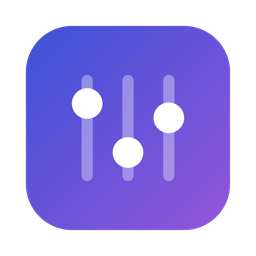
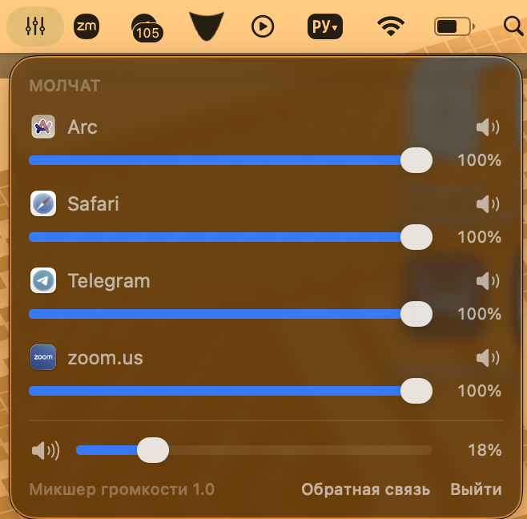

<p align="center">
  
</p>

<h1 align="center">Микшер громкости</h1>

<p align="center"><b>Громкость каждого приложения по отдельности — как в Windows, только на macOS.</b></p>

<p align="center">
  <a href="https://github.com/djet00/VolumeMixer/actions/workflows/ci.yml"></a>
  <a href="https://github.com/djet00/VolumeMixer/releases/latest"></a>
  
  
  <a href="LICENSE"></a>
</p>

<p align="center">
  
</p>

Zoom орёт, музыка шепчет, Telegram пикает поверх всего — а системный регулятор
громкости в macOS один на всех. Этот микшер живёт в menu bar и даёт каждому
приложению свой ползунок. В Windows так можно с 2007 года; теперь можно и здесь.

## Что умеет

- **Ползунок 0–100% и mute для каждого приложения** — двигаешь Spotify, Zoom не трогается
- **VU-метр** — сразу видно, кто именно шумит
- **Секция «Молчат»** — приглуши Telegram *до* того, как он пикнет
- **Настройки запоминаются** — приглушил один раз, останется и после перезапуска
- **Мастер-громкость** всей системы в той же панели
- **Без драйверов и расширений ядра** — официальный API CoreAudio (process taps), приложение весит меньше мегабайта

## Установка

**[Скачать DMG последнего релиза](https://github.com/djet00/VolumeMixer/releases/latest)** → перетащить в «Программы» → запустить.

Требуется macOS 15+.

<details>
<summary>macOS скажет «разработчик не подтверждён» — что делать (один раз)</summary>

Сборка подписана без платного аккаунта Apple, поэтому первый запуск macOS блокирует:

1. Открой **Системные настройки → Конфиденциальность и безопасность**
2. Внизу будет «"Микшер громкости" заблокировано…» — нажми **«Всё равно открыть»**
3. При первом запуске разреши **запись системного звука** — через этот механизм в macOS
   работает перехват аудио приложений. Микшер ничего не записывает и никуда не
   отправляет: весь код открыт, можешь убедиться.

</details>

## Как пользоваться

Клик по иконке в menu bar (справа сверху, рядом с часами) — открывается панель.
Сверху «Сейчас играют» — живые ползунки с VU-метрами. Ниже «Молчат» — приложения
с открытой аудиосессией: их громкость можно выставить заранее, применится при первом
же звуке. В подвале — общая громкость и кнопка обратной связи.

## Как это работает

На каждое играющее приложение создаётся muted process tap
([`AudioHardwareCreateProcessTap`](https://developer.apple.com/documentation/coreaudio/4160724-audiohardwarecreateprocesstap),
macOS 14.4+): система глушит оригинальный вывод процесса и отдаёт поток нам.
Дальше — приватное агрегатное устройство, умножение сэмплов на коэффициент
громкости (перцептивная квадратичная кривая) и вывод в текущее устройство.
RMS тех же сэмплов питает VU-метр. Смена наушников/динамиков пересоздаёт цепочку сама.

Курьёз, добытый отладкой: macOS не доставляет события изменения
`kAudioProcessPropertyIsRunningOutput`, поэтому список играющих обновляется
лёгким поллингом раз в 1.5 с — иначе приложения, зазвучавшие после запуска
микшера, оставались бы невидимыми.

## Сборка из исходников

Нужны только Command Line Tools (Xcode не обязателен):

```bash
git clone https://github.com/djet00/VolumeMixer.git && cd VolumeMixer
./build.sh && open "build/Микшер громкости.app"
```

Для разработки:

```bash
./test.sh        # тесты (swift-testing; обёртка добавляет пути к Testing.framework из CLT)
./dist.sh        # DMG с кастомным фоном (нужен create-dmg: brew install create-dmg)
```

Код разложен просто: [`Sources/VolumeMixerCore`](Sources/VolumeMixerCore) — вся логика
(монитор аудиопроцессов, tap-контроллеры, движок, настройки),
[`Sources/VolumeMixerApp`](Sources/VolumeMixerApp) — SwiftUI-панель,
[`scripts/`](scripts) — генераторы иконки и фона DMG,
[`docs/superpowers/`](docs/superpowers) — дизайн-док и план, по которым это строилось.

## Ограничения

- Все приложения играют в текущее устройство вывода — роутинга по устройствам нет
- Громкость вкладок браузера по отдельности невозможна на уровне системы
  (браузер сводит вкладки в один поток) — для этого есть расширения вроде Volume Master
- Эквалайзера и горячих клавиш нет — если нужно, [расскажи](https://github.com/djet00/VolumeMixer/issues/new/choose)

## Обратная связь

- Сломалось / не хватает — [Issues](https://github.com/djet00/VolumeMixer/issues/new/choose) или кнопка «Обратная связь» прямо в панели
- Сказать спасибо, спросить — [Discussions](https://github.com/djet00/VolumeMixer/discussions)
- Понравилось — звезда репозиторию, это лучший сигнал «полезно, продолжай»

## Лицензия и авторы

- **Лицензия:** [MIT](LICENSE)
- **Автор:** [@djet00](https://github.com/djet00) · Telegram — [@djet_00](https://t.me/djet_00)
- **Благодарности:** DMG собирается инструментом [create-dmg](https://github.com/create-dmg/create-dmg)

---

<details>
<summary>English</summary>

**The volume mixer macOS never shipped.** A menu bar panel with a volume slider,
mute button and live VU meter for every app that plays audio — plus a "Silent"
section to pre-set volumes for apps before they make a sound, a master volume
slider, and per-app settings that persist across restarts.

Built on the official CoreAudio process-tap API (macOS 14.4+): no kernel
extensions, no virtual audio drivers. Swift 6 + SwiftUI, builds with Command
Line Tools only. Requires macOS 15+.

**Install:** grab the DMG from [Releases](https://github.com/djet00/VolumeMixer/releases/latest),
drag to Applications. macOS will flag the unsigned build on first launch — allow
it in System Settings → Privacy & Security → "Open Anyway", then grant the
system-audio recording permission (that's how per-app audio interception works
on macOS; nothing is recorded or sent anywhere — the code is all here).

**Build from source:** `./build.sh` (CLT only, no Xcode needed). Tests: `./test.sh`.

The UI is in Russian for now — PRs for localization are welcome.

</details>
